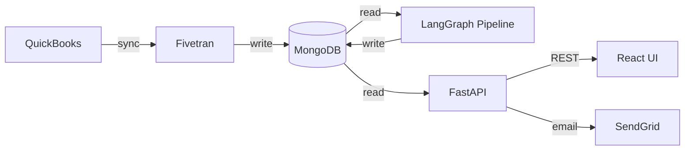
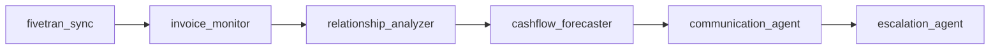
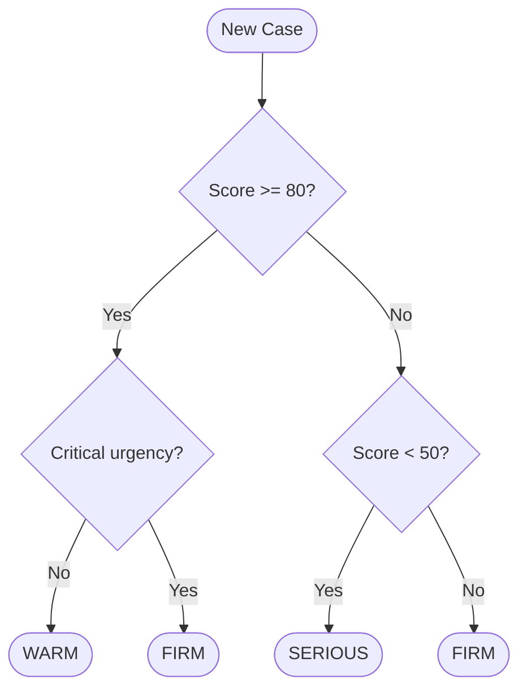
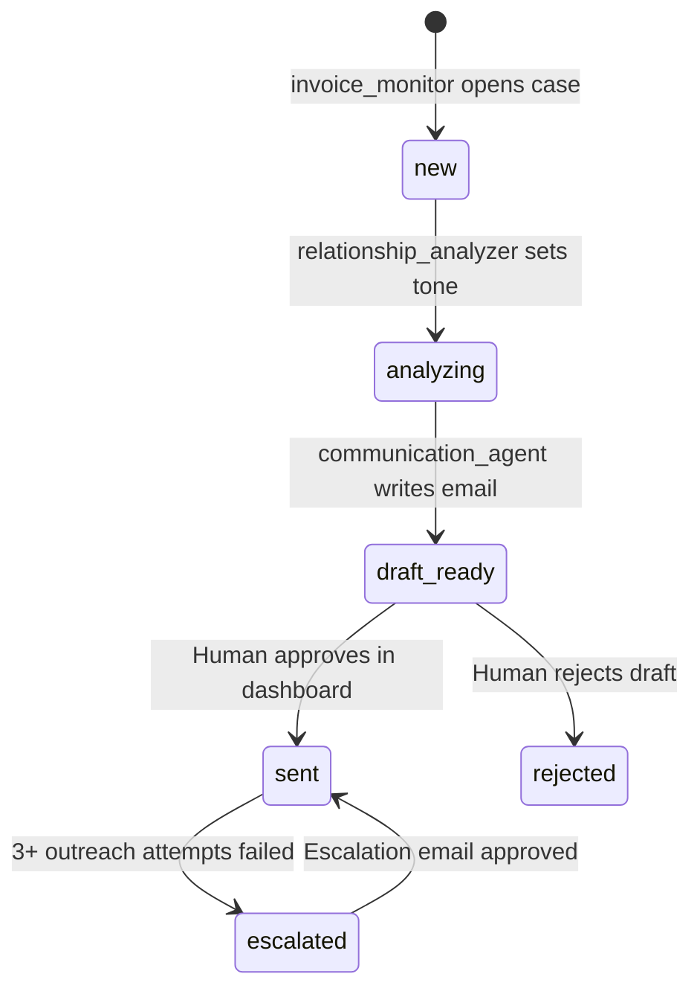
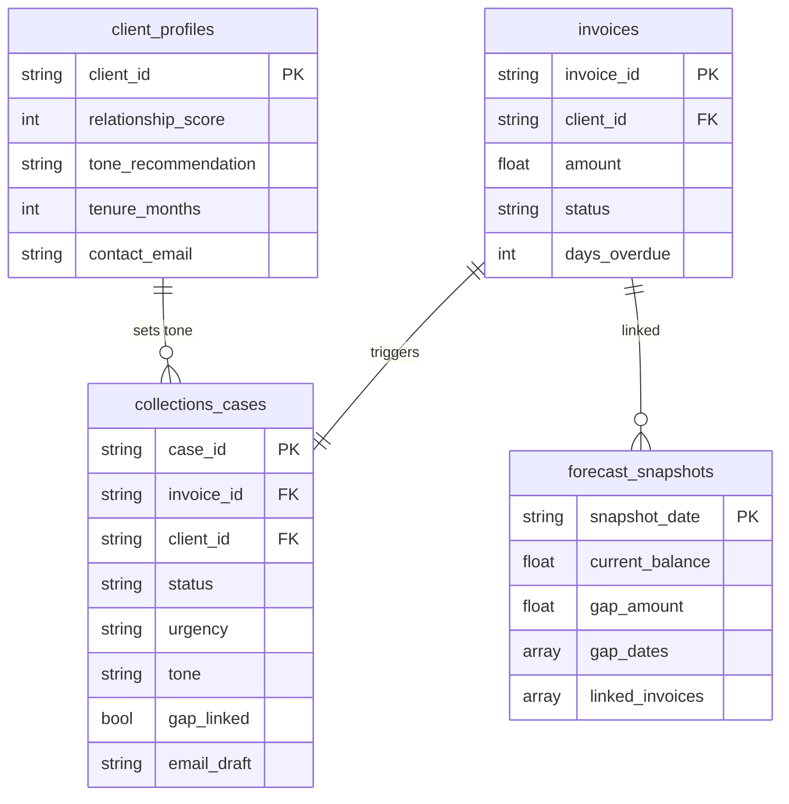

# CashGuard — AI-Powered SMB Cash Flow & Invoice Collections Agent

> Connect your financial data, predict cash shortages 60 days out, and automatically collect overdue invoices — with the right tone, at the right time — before the crisis hits.

Built for the **Google Cloud Rapid Agent Hackathon** · **Fivetran Track**

---

## The Problem

82% of small businesses that fail cite cash flow problems as the primary cause — not lack of revenue, but the inability to *see* the crisis coming and *act* on it. Existing tools show dashboards. **CashGuard acts.**

---

## End-to-End Architecture



---

## Agent Pipeline



| Agent | What it does |
|---|---|
| `fivetran_sync` | Triggers Fivetran connector to pull latest QuickBooks data into MongoDB |
| `invoice_monitor` | Scans overdue invoices, opens a CollectionsCase for each new one |
| `relationship_analyzer` | Reads client profile score, sets email tone (warm / firm / serious) |
| `cashflow_forecaster` | Builds 60-day balance projection, flags invoices that close the gap |
| `communication_agent` | Calls Gemini to draft a tone-aware collection email per case |
| `escalation_agent` | For cases with 3+ failed attempts, Gemini picks payment plan or demand letter |

---

## Tone Calculation

Email tone is determined by **relationship score** (0–100) from the client profile and **urgency** from days overdue. Rules applied in order:



| Tone | When | Gemini instruction |
|---|---|---|
| **warm** | Score ≥ 80, not critical | Friendly — assume oversight, acknowledge long relationship |
| **firm** | Score 50–79, or score ≥ 80 but critical | Professional and direct — state amount, request prompt payment |
| **serious** | Score < 50 | Final notice — state consequences if unpaid in 5 business days |

**Urgency** from days overdue:

| Days Overdue | Urgency |
|---|---|
| 1 – 7 | low |
| 8 – 14 | medium |
| 15 – 30 | high |
| 30+ | **critical** |

**Gap-linked override:** If the cash flow forecaster flags an invoice as needed to close a payroll/rent shortfall, that case is immediately promoted to `critical` regardless of age.

---

## Collections Case Lifecycle



---

## Data Model



---

## Stack

| Layer | Technology |
|---|---|
| Agent orchestration | LangGraph 1.2.4 (StateGraph) |
| API | FastAPI + Uvicorn |
| Database | MongoDB Atlas (Motor async driver) |
| LLM | Google Gemini (`gemini-flash-latest`) |
| Email | SendGrid |
| Data sync | Fivetran REST API |
| Frontend | React 18 + Vite 5 + Chart.js 4 |
| Containerisation | Docker (multi-stage: Node 20 → Python 3.11) |
| Hosting | Google Cloud Run |

---

## API Reference

| Method | Path | Description |
|---|---|---|
| GET | `/api/health` | MongoDB connection check |
| POST | `/api/pipeline/run` | Run full 6-agent LangGraph pipeline |
| GET | `/api/forecast/latest` | Latest 60-day cash forecast snapshot |
| POST | `/api/forecast/run` | Re-run cash flow forecaster only |
| GET | `/api/invoices` | All invoices |
| GET | `/api/invoices/overdue` | Overdue invoices only |
| GET | `/api/invoices/{id}` | Single invoice |
| GET | `/api/cases` | All collections cases |
| PATCH | `/api/cases/{id}/status` | Update case status |
| GET | `/api/approvals/pending` | Cases with drafted emails awaiting approval |
| POST | `/api/approvals/{id}/approve` | Approve and send email via SendGrid |
| POST | `/api/approvals/{id}/reject` | Reject draft |
| GET | `/api/connectors` | List Fivetran connectors |
| POST | `/api/connectors/{id}/sync` | Trigger Fivetran sync |
| GET | `/api/connectors/{id}/status` | Check sync status |

---

## Quick Start

```bash
git clone https://github.com/sivasundharam/cashguard.git
cd cashguard
python -m venv venv && source venv/bin/activate
pip install -r requirements.txt
cp .env.example .env          # fill in your keys
python -m seed.maria_catering # seed demo data
uvicorn app.main:app --port 8000 --reload
# frontend dev server (separate terminal):
cd frontend && npm install && npm run dev
```

See [DEMO.md](DEMO.md) for the full demo walkthrough.

---

## Deploy to Cloud Run

The repo includes a `cloudbuild.yaml`. Connect it to Cloud Run continuous deployment via the GCP Console, or deploy manually:

```bash
gcloud builds submit --tag gcr.io/$PROJECT_ID/cashguard
gcloud run deploy cashguard \
  --image gcr.io/$PROJECT_ID/cashguard \
  --platform managed \
  --region us-east5 \
  --allow-unauthenticated \
  --set-env-vars MONGODB_URI=... \
  --set-env-vars GEMINI_API_KEY=... \
  --set-env-vars SENDGRID_API_KEY=... \
  --set-env-vars SENDGRID_FROM_EMAIL=...
```

---

## License

MIT © 2026
